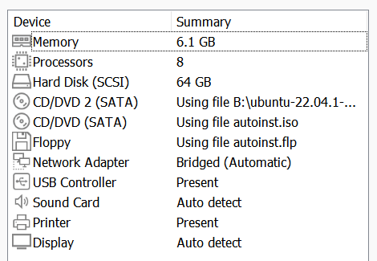
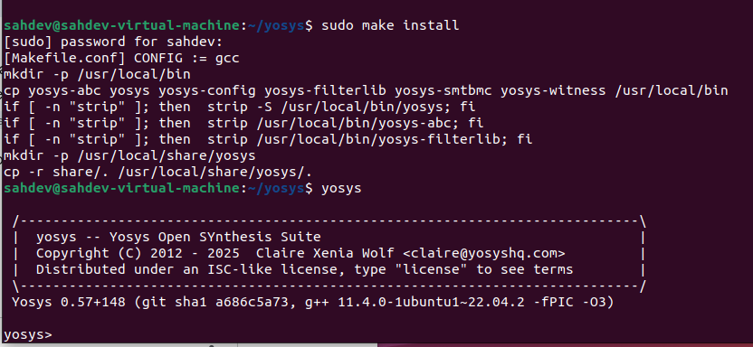
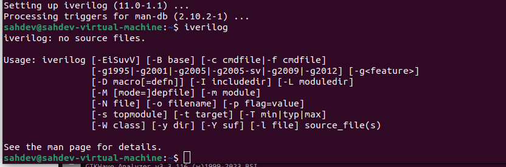
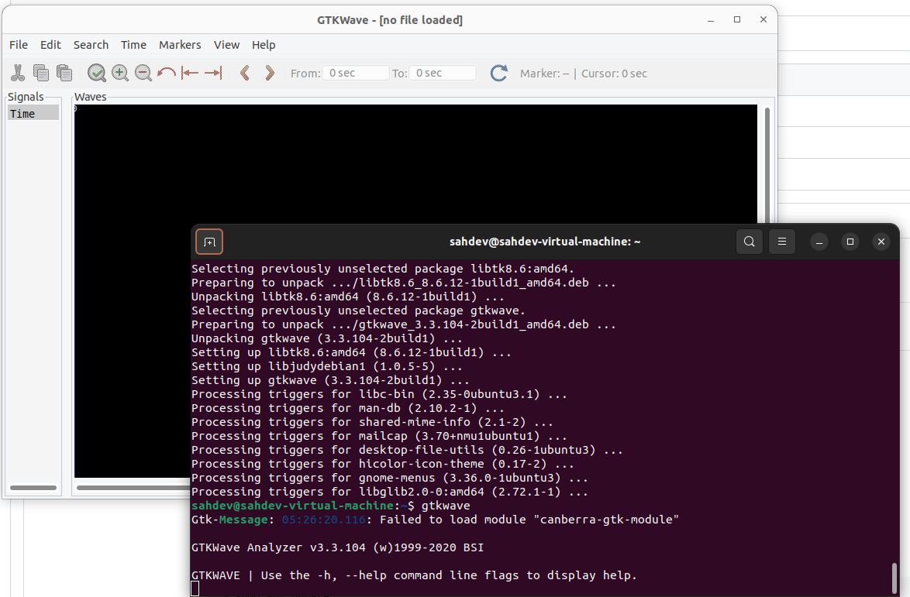

### System Specifications

This project was set up on a virtual machine to ensure a clean and controlled environment for tool installation and project work.

* **Operating System:** Ubuntu 22.04 LTS
* **Virtualization:** VMware
* **RAM:** 6 GB
* **Storage:** 64 GB

---

### Task 0: Tool Installation

**Objective:** To install the essential open-source tools: Yosys for synthesis, Icarus Verilog for simulation, and GTKWave for waveform viewing.

#### Yosys Installation

Yosys was successfully built and installed from source. This process was a good practice in resolving dependencies and managing a large compilation.

**Key Steps & Notes:**
* Cloned the Yosys repository and its required submodules.
* Installed all necessary dependencies. A temporary package lock was resolved by using `sudo kill` on the `unattended-upgr` process.
* The `make` command successfully compiled the entire project.
* The `sudo make install` command was run to install the tool globally on the system.

#### Icarus Verilog (iVerilog) Installation

The installation of iVerilog was straightforward and completed successfully using the system's package manager.

**Key Steps & Notes:**
* Icarus Verilog was installed directly via `sudo apt install iverilog`.
* The installation was verified by running the `iverilog` command in the terminal.

#### GTKWave Installation

The GTKWave waveform viewer was installed to visualize the output of digital simulations.

**Key Steps & Notes:**
* GTKWave was installed using the `sudo apt install gtkwave` command.
* The installation was verified by launching the GTKWave application from the terminal.

---
